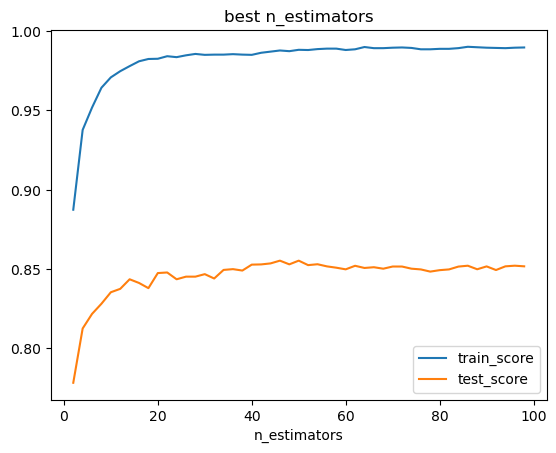

# group-project-2

We are predicting the quality of red and white wines from the north of portugal, using machine learning techniques.  We will use the UCI data sets to improve our model, and our ability to predict the quality of the wines. We are analysing the data looking for a specific outcome of good or bad quality.  (Based on expert reveiws) 

# Resources-Data set summary.  
The two datasets are related to red and white variants of the Portuguese "Vinho Verde" wine. For more details, consult: http://www.vinhoverde.pt/en/ or the reference [Cortez et al., 2009].  Due to privacy and logistic issues, only physicochemical (inputs) and sensory (the output) variables are available (e.g. there is no data about grape types, wine brand, wine selling price, etc.).

## Data Collection and Cleaning
The methods we used for our collection, steps to clean and prepprocess data. How did we hadle the missing values and outliers?

## Exploratory Data Analysis
Our approach was to build multiple models to take the base data and optimize it to predict the best scores using Random Forest Classifier, Gradient Boosting, Adaptive Boosting, Low/High Estimators, Logistic Regression, SVC Poly, and SVC Sigmoid 

Once we got the baseline scores Random Forest Classifier was the highest balanced test score.  So we decided to use that and built a function that searches through different Random Forest Classifier parameters to get the highest balance test score for the purpose of data optimization.

## Model Implementation
Our Jupyter notebook details the data extraction, cleaning, transformation, and exporting of the cleaned data as CSV files. A Python script effectively initializes, trains, and evaluates models, achieving ≥75% classification accuracy or 0.80 R-squared as required.

## Evaluation Metrics

Our approach was to build multiple models to take the base data and optimize it to predict the best scores using Random Forest Classifier, Gradient Boosting, Adaptive Boosting, Low/High Estimators, Logistic Regression, SVC Poly, and SVC Sigmoid.

Random Forest Classifier was the highest balanced test score.  So we decided to use that and built a function that searches through different Random Forest Classifier parameters to get the highest balance test score for the purpose of data optimization.

Random Forest 
Test Accuracy: 0.6726153846153846
balanced test score: 0.3510074145712444
classification report: 
               precision    recall  f1-score   support

           3           0.00      0.00      0.00                 7
           4           0.64      0.15      0.24               48
           5           0.70      0.74      0.72             528
           6           0.64      0.77      0.70             705
           7           0.71      0.46      0.56             282
           8           0.95      0.33      0.49               54
           9           0.00      0.00      0.00                 1

 accuracy                                       0.67      1625
 macro avg          0.52      0.35      0.39      1625
 weighted avg     0.68      0.67      0.66      1625

## Feature importance 
Analysis of feature importance, this is where the visualization of the top features should go

## Future Work
Potential improvements or any next steps. I think this is where adding our weather data and region can go. Any other questions we might have.

## Conclusion
- The Initial model shows overfitting and poor handling of class imbalance.

- The Binned model shows significant improvement in generalization and handling of class imbalance.

- The Sampled model shows good performance and handles class imbalance well, with a very small balanced difference.

- The Sampled and Binned model shows the best overall performance, generalizing well to the test data and handling class imbalance effectively, with the smallest balanced difference.

- The Sampled and Binned model is the most robust and well-performing approach based on these metrics

## References
Data sets,tools used, any writings we might have

## Project Overview:
=======
### Project Overview:

This project aims to predict the quality of wine based on various chemical properties using machine learning techniques. The wine quality dataset from the UCI machine learning repository is analyzed and processed. 

The goal is to build a robust predictive model to classify wine quality ratings acording to scientific standards.

### Target Variable:
Our target variable is 'quality', which aims to determine if a wine will be rated good or bad. The quality ratings in our data set range from 3 to 9. To classify the wines, we chose a threshold where wines rate 6 and above are considered 'good', while those rated below 6 are considered 'bad'. This decision was based on the distribution of the ratings where, 5 and 6 had the highest counts. By setting this threshold, we ensure that wines rated as mediocre are classified as 'bad', allowing us to focus on distinguishing the higher quality wines frome the rest.

### Requirements:
- python  
- pandas  
- sklearn  
	- metrics  
		- accuracy_score  
		- balanced_accuracy_score  
		- classification_report  
	- model_selection  
		- train_test_split  
	- utils  
		- resample  
	- preprocessing  
		- StandardScaler  
	- ensemble  
		- RandomForestClassifier  
		- LogisticRegression  
		- SVC  
		- GradientBoostingClassifier  
		- AdaBoostClassifier  
- matplotlib  
- seaborn  

### License
License: UC Irvine Machine Learning Repository  

This dataset is licensed under a Creative Commons Attribution 4.0 International (CC BY 4.0) license.  
This allows for the sharing and adaptation of the datasets for any purpose, provided that the appropriate credit is given.  

DOI: 10.24432/C56S3T  

[https://archive.ics.uci.edu/dataset/186/wine+quality](https://archive.ics.uci.edu/dataset/186/wine+quality)

UCI Machine Learning Repository  

Discover datasets around the world!  

# Instructions 
1. Install the requirements

2. Run main.ipynb file

# Conclusion
We were sucessful in predicting to a 93.6% balanced accuracy score for our RandomForestClassifier tuned model.
Baseline and best score summary visualilaztion.

## Conclusion

- The Initial model shows overfitting and poor handling of class imbalance.

- The Binned model shows significant improvement in generalization and handling of class imbalance.

- The Sampled model shows good performance and handles class imbalance well, with a very small balanced difference.

- The Sampled and Binned model shows the best overall performance, generalizing well to the test data and handling class imbalance effectively, with the smallest balanced difference.

- The Sampled and Binned model is the most robust and well-performing approach based on these metrics

  

  

  

  
  
  
  
  
  
  
  
  
  
  

 

